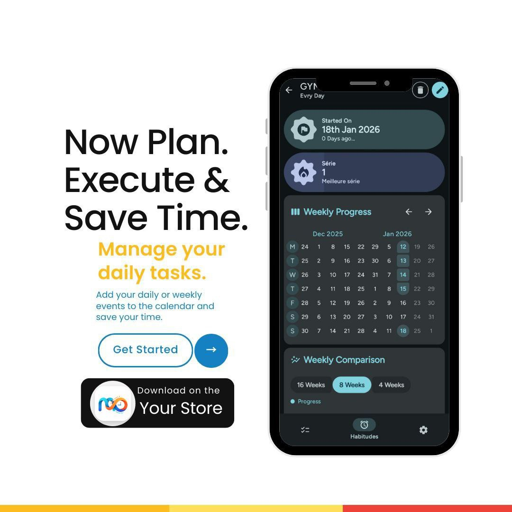
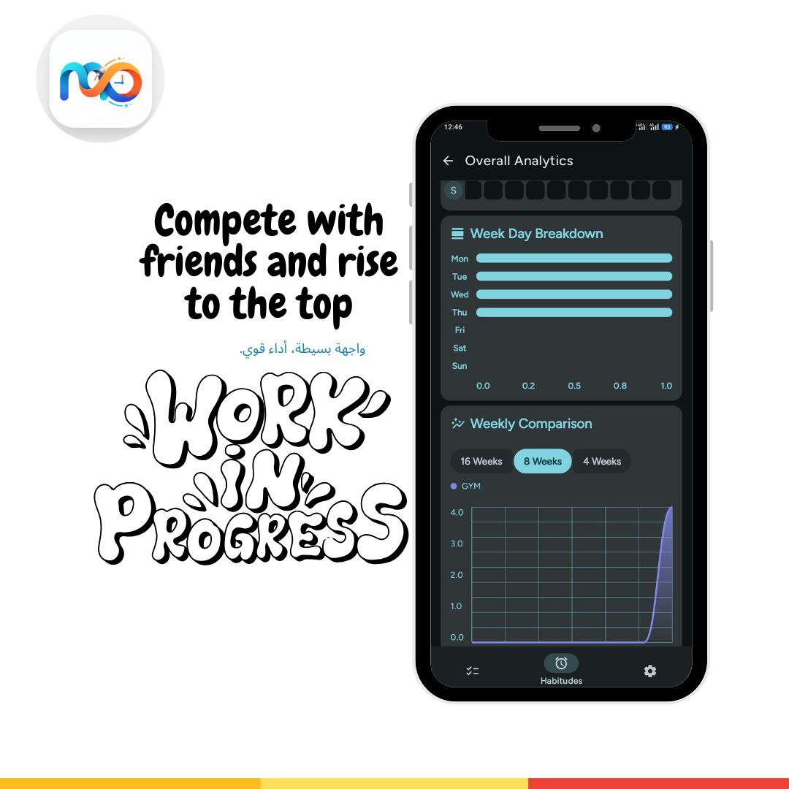

# 📱 Med Do: Habits & Tasks Manager

Med Do is an Android productivity app designed to help users track habits and manage daily tasks 
The app provides visual insights such as charts and statistics to monitor progress over time.

---

## 🚀 Features

- ✅ Habit tracking (daily / weekly / monthly)
- 📅 Task management system
- 📊 Statistics with charts and progress curves
- 📈 Performance tracking over time
- 💾 Local data storage (offline support)
- 🎯 Clean and simple user interface

---

## 🛠️ Tech Stack

- Language: Kotlin
- Platform: Android (Play Store)
- Storage: Local (on-device storage)
- Architecture: Unknown (likely MVVM structure)

---

## ❗️ Current Situation

The app originally included a subscription system (Google Play Billing) to unlock premium features.

I attempted to remove the subscription system and make all features free, but this caused multiple issues in the code.

---

## 🎯 Goal

- ❌ Completely remove subscription system
- ❌ Remove all Billing-related logic
- ✅ Keep all features unlocked (free access)
- ✅ Fix crashes and errors caused by removal
- ✅ Properly integrate AdMob ads (Banner)

---

## 📢 Ads Integration

- AdMob already added using personal account
- Banner ads implemented
- ❗️ Ads are NOT showing due to remaining subscription-related code conflicts

---

## ⚠️ Current Issues

- Errors appear after removing subscription logic
- AdMob ads do not display
- Some hidden dependencies still exist in the code
- App may crash or behave unexpectedly

---

## 🐞 Known Problematic Files

The issues seem to be related to these files:

- HabitViewModel.kt
- SettingsViewModel.kt
- GtitModules.kt

There may be other hidden dependencies not yet identified.

---

## 💡 What I Need Help With

I would appreciate help with:

- 🔍 Identifying all remaining billing/subscription-related code
- 🧹 Cleanly removing subscription system without breaking the app
- 🛠️ Fixing errors in ViewModels and related classes
- 📢 Fixing AdMob integration so ads display correctly
- 🧠 Best practices for switching from subscription → ads model

---

## 🧪 What I Tried

- Removed some Billing-related lines manually
- Unlocked premium features manually
- Added AdMob code

➡️ Result:
- Ads stopped working
- New errors appeared in multiple files

---

## 🧾 License

This project follows the original license:

GPL-3.0 License

---

## 🤝 Contributing

Any help is highly appreciated 🙏

You can:
- Open an issue
- Suggest fixes
- Submit a pull request

---
---

## 🧑‍💻 You Can Use This Code

You are free to use, modify, and build upon this project to create your own application.

However, if you plan to reuse this code, I kindly ask that you:

- Help fix the existing issues related to the subscription system removal
- Ensure the app works correctly without crashes
- Improve or properly integrate AdMob ads

This will help improve the project for everyone 🙏

> Note: This project is licensed under GPL-3.0, so any reused code must also remain open-source under the same license.S
## ⭐️ Support
## 📸 Screenshots

  
  
  
  
  
  

---

## 📲 Download on Google Play

If you find this project interesting, consider giving it a star ⭐️
